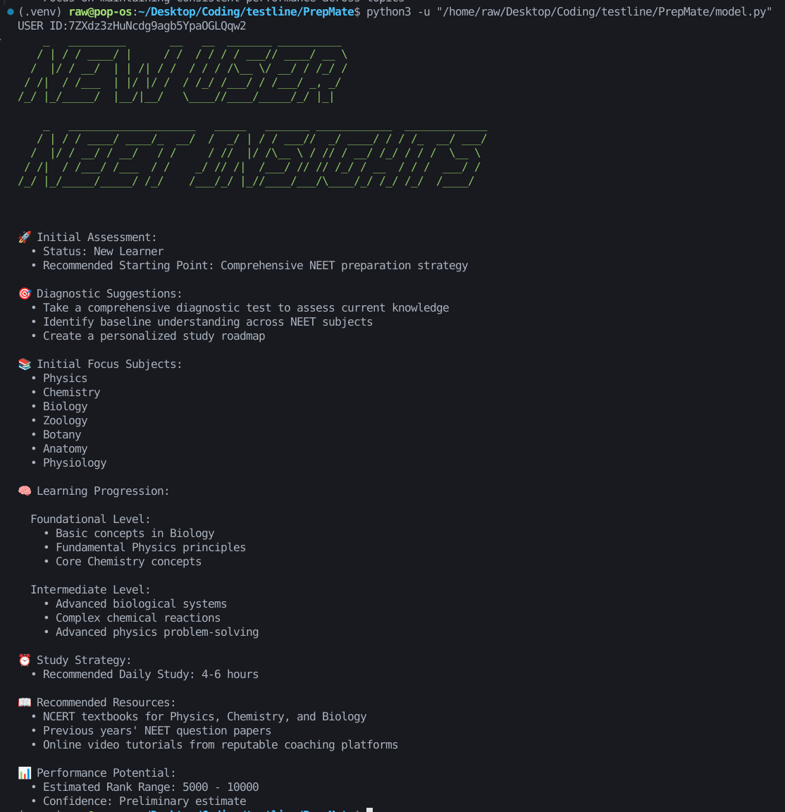

# NEET Student Performance Analytics (PrepMate)

## Project Overview
This is an advanced Python-based analytics system for tracking and analyzing student performance in NEET (National Eligibility cum Entrance Test) preparation, providing personalized insights and recommendations.

## Key Features
1. **Performance Analysis**
   - Detailed quiz performance tracking
   - Topic-level performance insights
   - Performance trend calculation

2. **Predictive Capabilities**
   - NEET rank prediction
   - Student persona generation
   - Learning strategy recommendations

3. **New User Onboarding**
   - Comprehensive initial assessment
   - Personalized learning roadmap
   - Subject focus recommendations

## Prerequisites
- Python 3.8+
- Required Libraries:
  ```
  numpy
  pandas
  scikit-learn
  termcolor
  pyfiglet
  ```

## Installation
1. Clone the repository
2. Install dependencies:
   ```bash
   pip install numpy pandas scikit-learn termcolor pyfiglet
   ```

## Project Structure
- `main.py`: Core analytics implementation
- `quiz_endpoints.json`: Quiz question metadata
- `quiz_submission_data.json`: Individual quiz submissions
- `historical_quiz_data.json`: Historical quiz performance data

## Usage
```bash
python main.py
```

### Inputs
- Provide a `user_id` when prompted
- Requires pre-existing JSON data files

### Outputs for Existing Users

- Total quiz performance
- Topic-wise accuracy
- Student persona
- NEET rank prediction
- Personalized improvement recommendations

### Outputs for New Users

- Initial learning assessment
- Diagnostic suggestions
- Subject focus areas
- Study strategy
- Preliminary rank projection

## Advanced Analytics Techniques
- Machine Learning Models
  - Gradient Boosting Regressor
  - Performance trend analysis
- Feature Engineering
- Personalized recommendation system

## Configuration Options
Customize performance analysis via `StudentPerformanceConfig`:
```python
config = StudentPerformanceConfig(
    performance_threshold_low=50.0,
    performance_threshold_high=80.0,
    confidence_interval=0.95,
    weak_topic_count=2
)
```

## Contributing
1. Fork the repository
2. Create feature branches
3. Submit pull requests